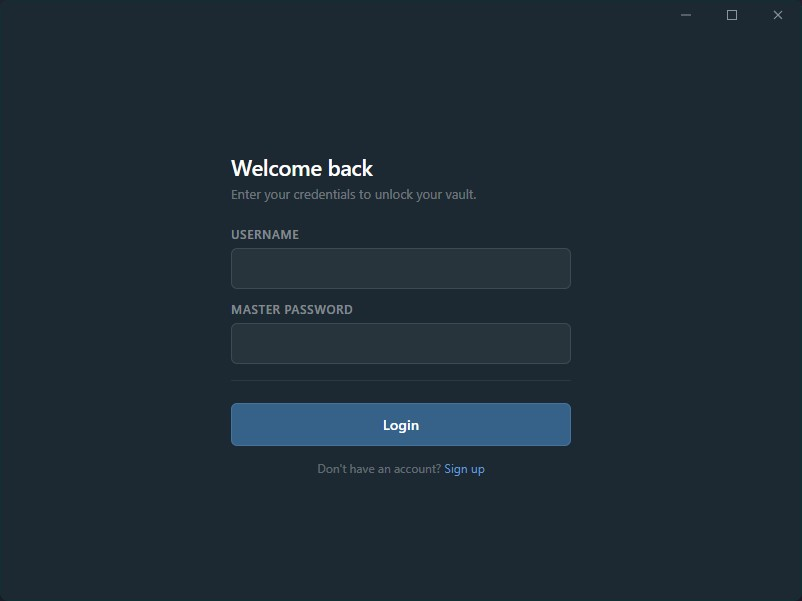
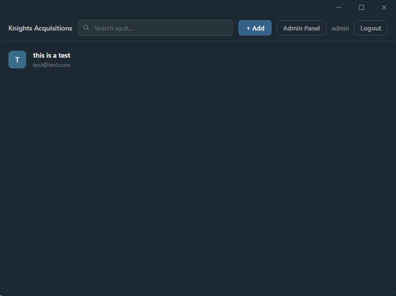
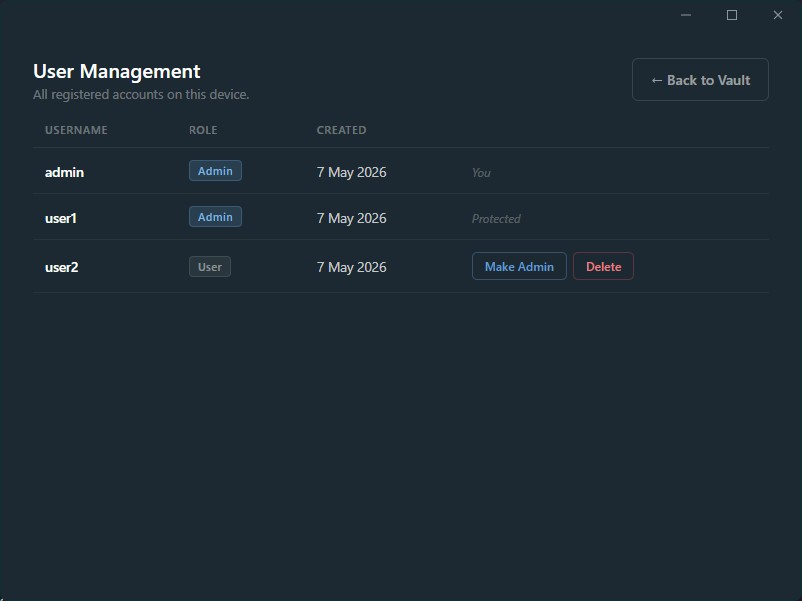

# Knights Acquisitions

A lightweight, local-first password manager built with Electron. Your vault never leaves your machine - everything is encrypted and stored on your device.

---

## What it does

Knights Acquisitions lets you store and manage passwords securely on your local machine. Each entry in your vault is encrypted with AES-256-GCM using a key derived from your master password, meaning even if someone gets hold of your data files, they can't read anything without it.

Key features:

- **Encrypted vault**: all entries encrypted with AES-256-GCM, master password never stored
- **Multiple accounts**: supports multiple users on the same device, each with their own private vault
- **Admin controls**: the first account created becomes admin, with the ability to manage and promote other users
- **Password generator**: generate strong random passwords directly from the add/edit form
- **Clean UI**: frameless window with a minimal, distraction-free interface

---

## How to use

### First run

When you open the app for the first time you'll land on the sign up screen. Create your account - the first account registered automatically becomes the admin.

You'll be asked to set a **master password** during sign up. This password encrypts your vault, so choose something strong and store it somewhere safe. There is no way to recover it if forgotten.

### Managing your vault

Once logged in you'll see your vault. From here you can:

- **Add an entry**: click `+ Add` and fill in the title, website, username, and password. Use the generate button to create a strong random password.
- **View an entry**: click any entry to see its details, copy the username or password, or follow the website link.
- **Edit an entry**: open the detail view and click `Edit`.
- **Delete an entry**: open the detail view and click `Delete`, then confirm.

### Admin panel

If you're an admin, an `Admin Panel` button will appear in the top bar. From there you can:

- View all registered accounts on the device
- Promote a standard user to admin
- Delete standard user accounts

---

## Screenshots

### Login

### Vault

### Admin panel

---

## Built with

- [Electron](https://www.electronjs.org/)
- [Electron Forge](https://www.electronforge.io/)
